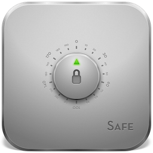
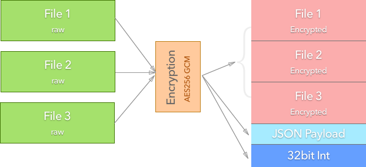

# Safe

Ever needed to secure your files in a fast and simple way ? Then look no further
because Safe is the simplest encryption utility that you'll ever need. Safe
features industry strength AES256 GCM encryption while being very easy to use
and very fast, which makes it perfect for daily use. You can now secure your
files, e-mail attachments or messages with ease without having to worry about
prying eyes.

<p align="center"></p>

## Installation

```bash
$ deno install
```

## Compilation

### Compile all platforms

```bash
$ deno run compile
```

### Compile specific platforms

For macOS

```bash
$ deno run compile:mac
```

For Linux

```bash
$ deno run compile:linux
```

For Windows

```bash
$ deno run compile:windows
```

## Running

### Running from source

```bash
$ deno ./src/safe.ts
```

### Running from compiled binaries

On macOS and Linux

```bash
$ ./build/[mac,linux]-[arch]/safe
```

On Windows

```bash
C:\Path_to_Safe/build/win/safe.exe
```

## Usage

### Encryption

> encrypt a single file

```bash
$ safe encrypt /home/downloads/secret.pdf /home/downloads/
```

> encrypt a folder and all files inside a folder recursively

```bash
$ safe encrypt /home/downloads/secret-folder /home/downloads/
```

### Decryption

> decrypt

```bash
$ safe decrypt /home/downloads/secret.safe /home/downloads
```

### List contents

> list encrypted files and show encryption info

```bash
$ safe list /home/downloads/secret.safe
```

## Functionality

### Chart

<p align="center"></p>

### JSON Payload

The JSON payload consists of an object containing all the encryption
information: file names, relative paths, sizes, SHA1 hashes, encrypted chunks
info, encryption date

```json
{
    "$schema": "https://json-schema.org/draft-07/schema#",
    "title": "Safe payload Schema",
    "type": "object",
    "required": ["files", "totalSize", "date"],
    "properties": {
        "files": {
            "type": "array",
            "items": {
                "type": "object",
                "required": ["path", "hash", "size", "chunks"],
                "properties": {
                    "path": { "type": "string" },
                    "hash": { "type": "string" },
                    "size": { "type": "number" },
                    "chunks": {
                        "type": "array",
                        "items": { "type": "number" }
                    }
                }
            }
        },
        "totalSize": { "type": "number" },
        "date": {
            "type": "string",
            "format": "date-time"
        }
    }
}
```

### 32bit Integer

This represents the size of the encrypted payload. In order to read the correct
amount of data for the payload we need to know the exact size of the encrypted
payload data.
